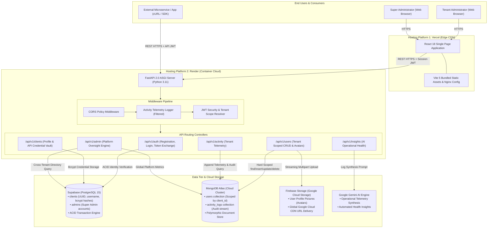

# System Architecture & Technical Specifications
## AI-Enabled Multi-Tenant User Management & Cloud Platform

This document details the multi-tenant architecture, data flow diagrams, network boundaries, and security perimeters implemented in the platform.

---

## 1. High-Level Architecture Diagram



---

## 2. Authentication & Data Flow Sequences

### Sequence 1: Interactive Dashboard Registration & Login
1. User enters `username` and `password` on the frontend.
2. Frontend calls `POST /api/v1/auth/register`.
3. Backend validates with Pydantic, salts and hashes the password with `bcrypt`, generates a UUID `client_id`, and inserts a record into Supabase `clients`.
4. User logs in via `POST /api/v1/auth/login`.
5. Backend issues a cryptographically signed Session JWT containing `sub: <client_id>`, `role: "client"`, and `type: "session"`.
6. Frontend stores the token and loads the dashboard.

### Sequence 2: One-Time API Credential Provisioning & Machine Token Exchange
1. Tenant clicks "Generate API Credentials" in the Credentials tab.
2. Frontend calls `POST /api/v1/clients/credentials` with Session JWT.
3. Backend generates high-entropy `client_id` (e.g. `cli_9e7196...`) and `client_secret` (e.g. `sec_88f912...`).
4. Backend hashes the secret with `bcrypt` (12 rounds) and saves it to Supabase `clients.client_secret_hash`.
5. The raw `client_secret` is returned to the frontend **only once** and displayed in a modal.
6. Outside programs invoke `POST /api/v1/auth/token` with `client_id` and `client_secret`.
7. Backend verifies against the bcrypt hash and issues an API JWT with `type: "api"`.

### Sequence 3: Tenant User CRUD & Isolation Enforcement
1. Tenant frontend requests `GET /api/v1/users`.
2. Auth middleware validates the JWT and resolves `request.state.tenant = {"client_id": "cli_9e7196..."}`.
3. Users router executes:
   ```python
   cursor = db.users.find({"client_id": tenant["client_id"], "is_deleted": False})
   ```
4. Only documents owned by the caller are returned.
5. If another tenant attempts `GET /api/v1/users/{other_user_id}`, the query returns `None` and the server responds with `HTTP 404 Not Found`.

---

## 3. Network Architecture & Security Boundaries

| Layer | Host / Provider | Protocol | Security Controls |
| :--- | :--- | :--- | :--- |
| **Client Tier** | Vercel Edge CDN | HTTPS / TLS 1.3 | HSTS, CSP, automated DDoS mitigation |
| **Application Tier** | Render Cloud Container | HTTPS / TLS 1.3 | Docker isolation, CORS validation, Pydantic data schemas |
| **Relational Data** | Supabase (AWS us-east-1) | TLS Encrypted PostgreSQL | Service role key isolation, encrypted at rest |
| **Document Data** | MongoDB Atlas (AWS us-east-1) | TLS Encrypted Wire Protocol | IP whitelist, SCRAM-SHA-256 authentication |
| **Object Storage** | Firebase / Google Cloud Storage | HTTPS / Google Cloud IAM | Role-based storage rules, SSL CDN endpoints |

---

*Verified architecture conforming to production cloud engineering standards.*
